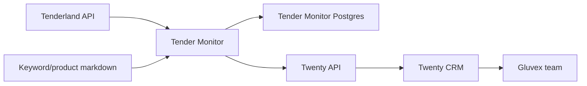

# Architecture

## Goal

Build a self-hosted commercial system for Gluvex where Twenty CRM is the team workspace and the tender monitor continuously finds, scores, enriches, and routes relevant tenders.

## Components

- Twenty CRM: companies, contacts, opportunities, tasks, notes, and sales workflow.
- Twenty worker: background jobs required by Twenty.
- Twenty Postgres and Redis: Twenty-owned persistence.
- Tender monitor API: ingestion, matching, scoring, deduplication, and future integration jobs.
- Tender monitor Postgres: monitor-owned tender snapshots, classifications, scores, and processing state.
- Source knowledge files: keyword packs and supplier/product reference tables.

## Data Flow

1. Tenderland autosearches return tender candidates.
2. Tender monitor stores raw source payloads and normalized tender fields.
3. Classifier scores the tender against Gluvex categories.
4. High-confidence tenders are enriched with product/platform matches.
5. Qualified tenders are pushed to Twenty via API as opportunities or tasks.
6. Sales users continue the workflow in Twenty.

## Integration Boundary

The tender monitor must not write directly into Twenty's database. Twenty remains upgradeable only if its database is treated as private implementation detail. Use API tokens, webhooks, or supported import paths.

## First Production Shape

## Matching Stages

- Stage 1: Keyword/category matching for fast filtering.
- Stage 2: Product/platform matching against supplier tables.
- Stage 3: Business rules: region, budget, deadline, customer, procurement law, exclusion terms.
- Stage 4: CRM routing: opportunity, task, watchlist, or reject.

## Initial Categories

- Molecular diagnostics: sequencers, NGS consumables, oncology panels, NIPT/PGT/HLA/microarrays, service.
- Analytical instruments: chromatography, mass spectrometry, ICP-OES/ICP-MS, AAS, UV/Vis, FTIR.

## Open Decisions

- Final server domain and HTTPS reverse proxy.
- Tenderland authentication shape and autosearch IDs.
- Twenty object model: whether qualified tenders become opportunities, custom objects, or both.
- Notification channel: email, Telegram, Slack, or only CRM tasks.

